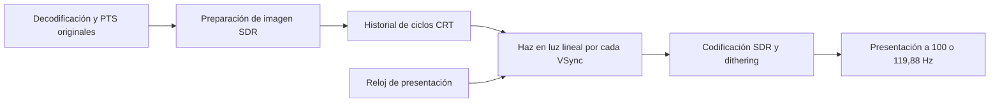
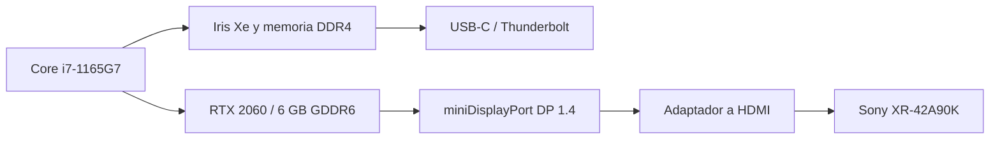

> Estudio previo a la implementación. El estado del código, las pruebas y las instrucciones actuales están en [CRT README](../README.md).

# Estudio de integración de CRT Electron Beam Simulator en mpv-winbuild

Fecha: 9 de octubre de 2026. Estado: análisis de código y validación matemática; todavía no hay una implementación compilada ni una prueba en el NUC/Sony.

El alcance es exclusivamente la simulación temporal de CRT de Mark Rejhon/Blur Busters y Timothy Lottes. La reproducción conservará la velocidad original. No se añadirá interpolación, generación de frames, RIFE, máscaras de fósforo, scanlines decorativas ni una función BFI independiente. Repetir un mismo frame durante varios barridos es parte de la presentación del CRT; no crea posiciones intermedias de movimiento.

Datos confirmados por el usuario: NUC11PHKi7C con RTX 2060 e Iris Xe, Sony XR-42A90K, mpv-x86_64-v3, contenido principalmente 24000/1001 fps y 25 fps, salida SDR y conexión miniDisplayPort→HDMI. Están disponibles 100, 120 y 119,88 Hz; el usuario confirma hasta 3840×2160, RGB y profundidades seleccionables de 8 a 12 bits en esas frecuencias. Falta conocer el modelo del adaptador, RAM instalada, Windows/controlador y modo de imagen/calibración de la TV para cerrar rendimiento y respuesta óptica. Se mantienen como datos confirmados los modos efectivos, aunque una ficha genérica enumere menos combinaciones.

## Conclusión técnica

La integración es viable en principio. Para conservar velocidad y cadencia se recomienda 119,88 Hz con 23,976 fps y 100 Hz con 25 fps. Ambos permiten los modos de uno y dos barridos por frame dentro del mínimo 2:1 recomendado por Blur Busters. El límite de 120 Hz sigue imponiendo compromisos perceptuales importantes para cine sin interpolación. La ruta recomendada para el resultado completo es un pase temporal en `vo=gpu-next`, apoyado en el hook `OUTPUT` de libplacebo, con control explícito de presentación y un historial persistente administrado por mpv. En la conexión miniDisplayPort del NUC, la GPU de salida es la RTX 2060, según la especificación oficial.

No es correcto afirmar que un shader de usuario sea incapaz de producir el efecto: existe un port comunitario de gavtroy, enlazado en el repositorio oficial, que usa `OUTPUT` y `TEXTURE STORAGE`. Es una referencia útil y una posible ruta de prototipo. Tampoco sería correcto presentar ese archivo, sin auditar sus límites, como una solución ya plenamente validada para esta TV, los dos fps y todas las operaciones de un reproductor.

El requisito fundamental es ejecutar el haz una vez por refresco presentado, independientemente de los fps de vídeo. No hace falta convertir la película a 120 fps ni activar la interpolación de mpv. La integración nativa recomendada añade control del ciclo de vida, tiempos y buffers; aprovecha el hilo de salida de vídeo existente y no requiere, de entrada, un nuevo reproductor o una bifurcación de libplacebo.

## Qué hace realmente el algoritmo original

Hay tres frecuencias independientes:

| Magnitud | Significado | Ejemplo para cine |
|---|---|---|
| `F_video` | Frames originales por segundo | 24000/1001 ≈ 23,976024 |
| `F_CRT` | Barridos del tubo simulado por segundo | 48000/1001 ≈ 47,952048 |
| `F_display` | Refrescos físicos de la Sony | 120000/1001 ≈ 119,880120 |

El parámetro original `FRAMES_PER_HZ` es `R = F_display / F_CRT`. **No es necesariamente `F_display / F_video`.** Los comentarios del shader y las respuestas de Blur Busters en las issues #4 y #6 lo explican expresamente. El autor admite ratios no enteros y recomienda al menos 2:1 para la simulación.

Cada canal RGB se convierte a luz lineal. El presupuesto de luz de un píxel es proporcional a `R × gain × intensidad_lineal`. El shader reparte ese presupuesto desde el instante en que pasa el haz, llenando primero el refresco disponible y continuando en los siguientes si hace falta. Los píxeles más luminosos tienen mayor persistencia. El algoritmo calcula solapamientos temporales entre esos intervalos de emisión y cada refresco de salida.

Esto explica tanto la reducción de persistencia como algunos bordes de color: canales de diferente intensidad pueden terminar de emitir en instantes distintos. Bajar `gain` reduce la persistencia a costa de luminancia. `gain=1` no proporciona la máxima claridad de los píxeles más brillantes.

La función de lectura del GLSL original es una **demostración**: desplaza horizontalmente una textura para imitar movimiento. Un port de esa revisión debe sustituirla por imágenes reales correspondientes a tres ciclos del CRT: actual, anterior y anteanterior. Son ciclos de CRT, no necesariamente tres frames distintos del vídeo. Si el CRT hace dos barridos por frame, dos entradas del historial pueden referirse a la misma imagen. **El número de entradas de historial no determina el número de barridos por frame.** La demostración actual de TestUFO usa otra formulación con dos edades; sus diferencias se examinan más adelante y no se trasladan como una optimización equivalente sin validación.

La simulación no deshace el desenfoque grabado por la cámara. Tampoco elimina el salto de posición entre dos frames de cine. Una fuente de 23,976 fps sigue teniendo aproximadamente 41,708 ms entre muestras de movimiento.

## Cadencias con la velocidad original

Se emplean fracciones exactas, no los rótulos redondeados de Windows.

| Contenido | Pantalla | Refrescos físicos por frame de vídeo | Consecuencia |
|---|---|---|---|
| 24000/1001 fps | 120000/1001 Hz | 5 | Cadencia física uniforme; pareja preferida para este contenido |
| 24000/1001 fps | 120 Hz | 1001/200 = 5,005 | En el modelo ideal, 199 frames de 5 refrescos y uno de 6 cada 200 frames; corrección aproximadamente cada 8,34 s |
| 25 fps | 120 Hz | 24/5 = 4,8 | Cuatro frames de 5 refrescos y uno de 4 por cada 5 frames; el orden depende de la fase |
| 25 fps | 120000/1001 Hz | 4800/1001 ≈ 4,795205 | En 1001 frames: 796 de 5 refrescos y 205 de 4 |
| 25 fps | 100 Hz, confirmado por el usuario | 4 | Cadencia uniforme; pareja preferida para este contenido |

La disponibilidad efectiva de 100 Hz queda confirmada. La elección recomendada es 119,88 para 23,976 y 100 para 25. El cambio de modo puede ser manual al principio; una automatización tendría que guardar y restaurar el modo anterior y reiniciar el estado temporal. Las parejas racionales proporcionan cadencia uniforme en el modelo nominal: pequeñas diferencias entre el reloj de audio y el refresco medido todavía pueden exigir correcciones de deriva, que deben registrarse.

25 fps a 120 Hz no permite duraciones idénticas de frames completos sin cambiar velocidad, refresco o la representación de la cadencia. El CRT puede redistribuir luz entre refrescos y el algoritmo admite `R` fraccionario; eso no convierte la fuente en muestras de movimiento uniformes a 120 fps ni garantiza que desaparezca el judder. La conservación de energía se debe comprobar además por frame/ciclo, no solo como promedio de una secuencia larga.

## Cuántos barridos simular

| Modo del CRT | Para 23,976 fps a 119,88 Hz | Para 25 fps a 100 Hz | Compromiso |
|---|---|---|---|
| Un barrido por frame | `F_CRT=24000/1001`, `R=5` | `F_CRT=25`, `R=4` | Una exposición por muestra; parpadeo muy bajo en frecuencia y potencialmente intenso |
| Dos barridos por frame | `F_CRT=48000/1001`, `R=2,5` | `F_CRT=50`, `R=2` | Mejor frecuencia de parpadeo; la misma posición aparece en dos exposiciones |
| CRT fijo a la mitad del refresco | `F_CRT=60000/1001`, `R=2` | `F_CRT=50`, `R=2` | Para 25 fps coincide con dos barridos; para 23,976 añade repetición 2:3 en ciclos CRT |
| Tres barridos por frame | `F_CRT=72000/1001`, `R≈1,667` | `F_CRT=75`, `R≈1,333` | Fuera del criterio 2:1 recomendado por el autor para estos modos de pantalla |

El punto de partida recomendado es **dos barridos por frame**, con un selector explícito para un barrido. Es una política del host, no una alteración del núcleo ni una garantía de confort: 47,952/50 Hz todavía pueden producir parpadeo visible. Hay que comparar el mismo algoritmo con un barrido por frame para valorar claridad frente a parpadeo. Esto sigue siendo CRT Electron Beam Simulator en ambos casos. El código canónico no impone uno o dos: declara independientes la frecuencia del CRT, el refresco nativo y los fps subyacentes. Sus ejemplos de CRT a 60 Hz no constituyen una obligación para una película de 23,976 o 25 fps.

La repetición de barridos puede producir imágenes múltiples cuando los ojos siguen el movimiento: se ilumina dos veces la misma posición original. Aumentar `F_CRT` no crea una nueva posición entre frames. Con 120 Hz no hay un ajuste que garantice simultáneamente exposición única, alto refresco del CRT, movimiento de cine continuo y ausencia de parpadeo.

El barrido fijo a 59,94/60 Hz es una posibilidad del algoritmo, pero no lo elegiría automáticamente para estas películas: 23,976→59,94 implica repetición 2:3 de frames en ciclos de CRT, y 25→60 también es no entero. No hay que confundir que la pantalla reciba 120 refrescos con que el tubo simulado opere a 120 Hz.

Los presets propuestos calculan `F_CRT = barridos × F_video` y `R = F_display / F_CRT`. La ganancia automática de TestUFO es exactamente `1/R`; su shader incorporado también documenta ese valor para la opción de máxima claridad, a costa de luminancia. **El GLSL del repositorio no implementa un selector automático de ganancia:** su ejemplo fija `R=4`, `gain=0,7` y `GAMMA=2,4`. La ganancia automática propuesta adopta la política de la demostración oficial, usando el parámetro de ganancia que ya admite el núcleo original. Se conserva además su control manual, sin agregar otra función de procesado.

| Fuente | Pantalla preferida | Barridos/frame | CRT simulado | `R` | Ganancia automática |
|---|---|---|---|---|---|
| 24000/1001 fps | 120000/1001 Hz | 1 | 24000/1001 Hz | 5 | 0,20 |
| 24000/1001 fps | 120000/1001 Hz | 2 | 48000/1001 Hz | 2,5 | 0,40 |
| 25 fps | 100 Hz | 1 | 25 Hz | 4 | 0,25 |
| 25 fps | 100 Hz | 2 | 50 Hz | 2 | 0,50 |

Con dos barridos de 23,976 fps, `R=2,5` alterna límites de ciclos CRT entre refrescos físicos. No se debe redondear a 2 o 3, ni alternar arbitrariamente la velocidad del haz. Se integra la exposición fraccionaria con la fórmula original. Los cinco refrescos por frame de vídeo siguen siendo uniformes nominalmente; dos barridos no significan duplicar primero el archivo y tratarlo como vídeo generado.

## Qué aportan las implementaciones consultadas

**Blur Busters original.** Es la referencia del núcleo temporal y de la licencia MIT. La issue #6 exige procesamiento por refresco aun con vídeo de 24 fps, señala los cambios necesarios en el flujo de shaders y recomienda Vint como ejemplo de aplicación. Las promesas antiguas de una versión futura en comentarios/README no demuestran que esa versión esté publicada; este estudio usa la revisión concreta indicada al final.

**TestUFO.** Ya se consultaron la página y su JavaScript público `__crt.js?version=202609271641`, descargados el 9 de octubre de 2026. Se inspeccionó el código, sin ejecutar la demostración en una GPU o en la Sony. Calcula `R = refresco mostrado / CRT simulado`, aplica un mínimo 2 y, cuando se selecciona «Auto Calc - Maximum Possible», entrega `GAIN_VS_BLUR=1/R`. Con la autodetección actual, 120 Hz conduce a CRT de 60 Hz; 100 Hz conduce a 50 Hz. No examina los fps de una película para elegir esos valores.

La captura del usuario corresponde a `120/60=2`, ganancia automática 0,50, gamma 2,2, barrido superior→inferior, tiempo real y compensación LCD desactivada para OLED. Sus «120 fps» son la tasa de render de la demostración, no la tasa de una película ni la frecuencia del CRT simulado. «6 pixels/frame» es `720/120` para su indicador de movimiento. Una imagen estática no prueba ausencia de refrescos perdidos, retardo o calibración gamma. La comparación web también puede igualar la luminancia de la mitad sin efecto (`SPLITSCREEN_MATCH_BRIGHTNESS=1`), por lo que no debe usarse una captura para deducir la pérdida de luminancia absoluta.

La versión web servida hoy difiere del GLSL publicado en GitHub: usa gamma pura `pow(c, GAMMA)` y su inversa, dos edades de CRT y una exposición adelantada 0,5 refrescos. El repositorio sigue en `734786a`, verificado de nuevo por `git ls-remote`. Se establece esa revisión MIT como referencia principal del núcleo y se documenta la transferencia SDR correcta como adaptación explícita. No se mezclan cambios de la web con el original sin estudiar su efecto; el copyright de la página tampoco demuestra que todas sus revisiones tengan la misma licencia del repositorio.

| Aspecto | GLSL publicado en GitHub | TestUFO servido en la consulta |
|---|---|---|
| Historial | Actual, anterior y anteanterior | Actual y anterior |
| Transferencia | Fórmula sRGB con exponente ajustable y problemas reconocidos en issue #17 | Gamma pura y su inversa |
| Exposición | Inicio en la fase nativa calculada | Inicio en esa fase + 0,5 refrescos |
| Ganancia de ejemplo/política | Constante 0,7, ajustable al portar | Automática `1/R` o selección manual |
| Relación nativa:CRT | Constante de ejemplo 4, con soporte de ratios fraccionarios | Detectada y limitada a un mínimo 2 |
| Barridos por frame real de vídeo | No prescritos: la frecuencia del contenido es independiente | No prescritos: la demo genera movimiento desde una textura |

Una comprobación CPU nueva de las ecuaciones servidas por TestUFO encuentra que omitir la edad anteanterior no es equivalente en general, incluso con ganancia automática: con campo blanco, `R=2`, `gain=0,5` y posición de barrido `0,9999`, la media lineal del modelo de dos edades es aproximadamente `0,2501`, mientras la referencia de tres conserva `0,5`. Añadir la edad omitida con el mismo desplazamiento de exposición restaura la media. Este resultado es un contraejemplo matemático de equivalencia; **no es una medición de la web, del navegador ni de la Sony**, ni demuestra que las bandas de la captura tengan esa causa. Refuerza la elección conservadora de mantener las tres edades de la revisión publicada.

**ShaderBeam.** Su CPU calcula fase y contador usando doble precisión; su shader toma tres texturas. Presenta con `Present1(1)` y mantiene contadores de subframes. Desactiva la protección de inversión de LCD en OLED y dispone de resincronización. Es una referencia especialmente útil para Windows y su diagnóstico de frames perdidos. Su modo de menor latencia llega a sobrescribir/aliasar entradas del historial: no debe copiarse como equivalente exacto de la versión con tres ciclos reales sin validar las diferencias. Su sistema de captura del escritorio tampoco es necesario dentro de mpv.

**RetroArch.** Proporciona `TotalSubFrames`, `CurrentSubFrame` y `FrameCount`, demostrando que el host necesita una infraestructura de subframes. La revisión del `.slang` examinada lee `Source` para las tres edades; no tiene tres texturas de historial distintas en esa función. Es una adaptación útil para entender parámetros y subframes, pero no debe suponerse que aporta automáticamente el historial exigido por una integración de vídeo fiel. Sus constantes referidas a 60 fps no se deben trasladar a cine como si fueran un requisito del algoritmo.

**Port de gavtroy para mpv.** Usa un único hook `OUTPUT`, la variable `frame`, lecturas `imageLoad` y escrituras `imageStore` en una textura persistente. Guarda dos imágenes previas y lee la actual desde `HOOKED`. Por tanto, un port con estado en un shader de usuario sí es técnicamente posible en `gpu-next`.

Hay límites concretos que resolver en ese port: textura fija `2048×2048×32`, formato `rgb16` no disponible de forma universal entre APIs, protección LCD activa por defecto, gamma heredada, historial inicialmente sin datos definidos y ausencia de tratamiento explícito de seek/pausa/cambio de tamaño. La reserva nominal es 768 MiB a 6 bytes/texel y puede ascender a 1 GiB si el backend representa el RGB como RGBA. No es memoria que deba reservarse independientemente de la resolución del vídeo.

Además, la actual se lee sin enclavar al inicio del ciclo de CRT y las anteriores se guardan al final del ciclo. En una relación fraccionaria, el frame de vídeo puede cambiar dentro de un ciclo simulado. Un modelo CPU con cambios de fuente redondeados al VSync demuestra que ese esquema puede diferir del historial enclavado. Es una evidencia de diseño; no una prueba de ejecución de ese archivo en Windows. El contador `frame` del parser de libplacebo crece por pase del propio shader y no mide necesariamente refrescos físicos que realmente llegaron a la TV.

**Vint.** Ya se consultaron Steam (app 3448910), su ficha JSON pública y la web/documentación del desarrollador William Sokol Erhard. La documentación confirma expresamente que usa mpv para reproducción en tiempo real; Steam describe CRT Beam Scanout Emulation de fuentes de vídeo arbitrarias, en beta, con un multiplicador 4× y más opciones en desarrollo. La descripción pública no especifica suficientemente a qué reloj se aplica ese multiplicador ni cómo administra sus buffers. No es una especificación del scheduler que deba copiarse para cine a 100/120 Hz.

Es inspiración válida para el control del efecto, estadísticas y reproducción, pero su implementación interna no está publicada en las fuentes consultadas. La aplicación declara uso de dependencias abiertas y licencia propia para uso no comercial; eso no hace abierto su código. Sus benchmarks/requisitos de TensorRT, OpenVINO o RIFE describen interpolación y no permiten estimar el coste de este shader en la RTX 2060. Su interpolación, BFI independiente, captura UVC y otras funciones quedan fuera del proyecto.

## mpv: caché y punto de integración

La lectura del código actual distingue dos rutas:

- En `vo=gpu`, sin interpolación, `gl_video_render_frame()` reutiliza una textura de salida para repeticiones. Además, el uniforme `frame` se llena con `frames_uploaded`. Un shader convencional no garantiza un haz diferente en cada VSync.
- En `vo=gpu-next`, mpv también permite caché de frames, pero libplacebo excluye expresamente los hooks exclusivamente `PL_HOOK_OUTPUT` del hash del procesamiento previo y ejecuta ese hook en el pase de salida. Es el punto apropiado para mantener el procesamiento costoso del contenido en caché y calcular el haz en cada presentación.
- `SAVE` guarda texturas intermedias del pase; no constituye por sí mismo un anillo de frames anteriores. `TEXTURE STORAGE` sí puede mantener estado, como demuestra el port comunitario. Un hook nativo también puede administrar texturas propias de tamaño dinámico.
- El hilo de VO de mpv ya dibuja y hace `flip_page()` por los `num_vsyncs` de un frame en modo display-sync. No es obligatorio crear un segundo bucle que compita con ese presentador.

El contador debe corresponder a la línea temporal de presentación. Un temporizador Lua de 8,3 ms no proporciona sincronización física al VSync. `PTS` representa el tiempo del frame de vídeo y se mantiene durante sus repeticiones; tampoco es el reloj del haz.

En D3D11, mpv obtiene estimaciones de DXGI con `GetFrameStatistics()` y `GetLastPresentCount()`, pero el código examinado declara que aún no informa `skipped_vsyncs`. Una integración exigente debe mejorar o complementar ese diagnóstico. Una tasa media de 120 renders por segundo no prueba una secuencia correcta sin refrescos perdidos.

## Arquitectura recomendada

1. Mantener la decodificación y el audio a velocidad original. La selección de imágenes se hace por PTS y duración real, sin sintetizar frames. El audio conserva su papel en A/V.
2. Preparar la imagen con conversión de color y ajustes de imagen antes del efecto. La referencia original recomienda aplicar el haz al framebuffer original y escalar después; para vídeo también es posible preparar a tamaño de salida y simular la emisión de los píxeles de la TV. No son numéricamente intercambiables: la transformación temporal es no lineal. Para esta integración recomendaría una imagen preparada a tamaño de presentación, en SDR bien definido, y validar la diferencia contra la referencia de origen. Escalar después puede mezclar emisiones de filas y requiere verificar que no altera la envolvente temporal.
3. Enclavar una imagen por ciclo de CRT y conservar tres entradas lógicas. Una misma imagen puede reutilizarse cuando hay dos barridos por frame. Registrar `cycle_id`, `source_id`, PTS y referencia de textura; no rotar por cada refresco físico ni confundir el historial con la cola normal de decodificación.
4. Ejecutar el núcleo temporal por cada presentación usando `R`, fase, dirección de barrido, intensidad y las tres referencias. Fase en doble precisión en CPU, contador de 64 bits y uniforms pequeños/acotados en GPU. Evitar el agotamiento de precisión de un contador enorme convertido directamente a `float`.
5. Obtener y conservar buffers GPU propios; una textura temporal prestada por el hook no es válida como historial indefinido. Usar formatos soportados, preferentemente RGBA FP16 para el trabajo lineal, con inicialización definida y barreras correctas.
6. Aplicar únicamente la codificación de salida, cuantización/dithering y composición que se haya decidido después del haz. No añadir contraste dinámico ni otra conversión de gamma inadvertida sobre sus pulsos.
7. Manejar seek, pausa, EOF, archivo nuevo, cambio de fps, tamaño, HDR accidental, cambio de pantalla, reconfiguración de GPU y pérdida de device. Al pausar no se puede dejar congelada una banda temporal: recomendaría mostrar la imagen estática normal y reinicializar el historial al reanudar. Vaciar imágenes del archivo anterior y definir el priming al arrancar. El callback `reset` de un hook de libplacebo se llama por pase y no equivale a un seek: no debe borrar el historial en cada render.
8. Cuando el display-sync no esté activo o haya presentación irregular persistente, desactivar de forma explícita el efecto, mostrar una imagen completa y registrar la causa. No continuar silenciosamente con una fase incorrecta.

La fase vertical debe referirse a la posición de presentación en pantalla, incluyendo el desplazamiento del rectángulo de vídeo. En cine con barras negras, `uv.y` de la imagen activa no equivale automáticamente a la coordenada física de la Sony. Hay que considerar crop, letterboxing, orientación y dirección real del scanout.

Los subtítulos y el OSD requieren una política explícita. Los overlays de destino pueden componerse después del hook `OUTPUT`; no hay que asumir que todo lo visible pasa ya por el haz. Para simular los subtítulos con la película, deben componerse antes de crear las imágenes del historial. El OSD de controles puede mantenerse estático aparte.

Debe medirse el retardo A/V: en la fórmula publicada, `startCurr = tubeFrame + R` y buena parte de la emisión corresponde al ciclo anterior. Un port con historial fiel puede añadir un retardo del orden de un ciclo CRT, además de las colas normales y el retardo de la TV. No se debe ocultar ese retardo ni reducirlo aliasando buffers sin evaluar el efecto. Una corrección nominal de tiempo puede alinear A/V, pero el centro de emisión varía con fila, intensidad y `gain`; no todo se resume en un retraso idéntico por píxel.

## Color SDR: corrección necesaria dentro del alcance

La issue #17 es fundamental. Señala que cambiar el exponente dentro de la fórmula sRGB no equivale a configurar una gamma pura, rompe el punto de unión de sus tramos y cuestiona el `clamp()` original. Blur Busters reconoce allí desviaciones matemáticas y la necesidad de funciones de transferencia configurables. Por tanto, copiar `GAMMA=2.4` y ajustar la Sony a 2,4 no demuestra que el presupuesto de fotones sea correcto.

El diseño debe conservar el núcleo de intervalos, separándolo de una pareja EOTF/inversa explícita para la salida SDR real. Si la TV presenta una curva aproximadamente gamma 2,4 o BT.1886, la imagen y la inversa de salida deben corresponder a esa curva; sRGB tiene una transferencia distinta. No debe cambiarse la etiqueta de color para resolverlo, ni aplicar una doble conversión por hardware sRGB.

Las funciones `linearize()`/`delinearize()` de libplacebo son una vía útil porque disponen de los metadatos del hook, pero solo serán correctas si estos describen la señal y la respuesta final. Es necesario verificar niveles completos/limitados, primarias, curva de salida y tratamiento del compositor de Windows. Se trabajará en luz lineal sin clipping previo y se comprobará negro cero, rampas y media luminosa de ciclos completos.

La gamma pura 2,2 de TestUFO es una pareja de funciones distinta de la sRGB modificada del GLSL antiguo y resuelve esa diferencia de definición. El «2,2» mostrado por la web es un parámetro del shader: no demuestra que la respuesta real de esta Sony sea exactamente 2,2. Se deben conservar el núcleo temporal y las tres edades de GitHub, usando una transferencia explícita que corresponda al perfil SDR medido; la sustitución de la transferencia queda documentada y verificada por separado. La fidelidad al algoritmo no exige reproducir una discontinuidad de transferencia reconocida por su autor.

Para OLED se desactiva `LCD_ANTI_RETENTION`: no es necesaria la compensación de inversión de polaridad de LCD, que añade deriva entre el CRT y el contenido. `FPS_DIVISOR=1`, sin split-screen en uso normal. Dirección inicial top-to-bottom, verificando orientación. La ganancia inicial automática es `1/R`, siguiendo la política de TestUFO: 0,40 para dos barridos de 23,976 fps a 119,88 Hz y 0,50 para dos de 25 fps a 100 Hz. Se conserva el control manual original para ajustar persistencia y luminancia. No se impone 0,50 a todas las relaciones.

La TV debe recibir SDR estable, con interpolación/Motionflow y BFI/Clearness desactivados, sin sensor de luz ni ajustes dinámicos que cambien la transferencia entre subframes. Desactivar también el procesado de cadencia/Film mode para evitar que la TV trate los subframes como una película convencional. Usar refresco fijo, con VRR desactivado, mientras se valida esta implementación. La guía general oficial Sony de 2022 documenta Motionflow, Clearness, Film mode, HDMI video range y formatos HDMI mejorados, con condiciones por modelo y región. Preferir un modo de imagen con respuesta estable y baja latencia; confirmar sus nombres y efectos en la unidad. No asumir que el ABL/ASBL de la A90K se pueda desactivar mediante ajustes normales, ni depender de cambios de menú de servicio. El nivel de luminancia y tamaño de áreas claras deben mantenerse en una región donde la respuesta sea estable y comprobarlo ópticamente.

Para empezar, salida RGB de 10 bits es una elección útil para evitar cuantización visible en pulsos oscuros, con rango de vídeo del controlador y TV concordantes. 8 bits sigue siendo técnicamente posible; 12 bits seleccionables en el enlace no demuestran un panel nativo de 12 bits ni un swapchain de 12 bits. En mpv D3D11, `d3d11-output-format=auto` suele elegir `rgba8` o `rgb10_a2`, según escritorio; `gpu-next` lo interpreta como indicación y libplacebo decide el formato final. Confirmarlo en el log. No usar `d3d11-output-format=rgba16f` como receta de salida SDR de 12 bits: en `gpu-next` ese ajuste activa scRGB. Los buffers FP16 internos recomendados son independientes del formato del enlace y de la señal de salida.

## Hardware y presupuesto de rendimiento

Se descargó la **Technical Product Specification del NUC11PHKi7C, revisión 1.4 de agosto de 2023**, publicada actualmente por ASUS. Su ficha de soporte fecha la descarga en marzo de 2024; no se confunde esa fecha con la revisión del documento. Las secciones 1.1.3, 3.2 y la figura 4 proporcionan estos datos relevantes:

| Componente | Especificación verificada | Implicación para este proyecto |
|---|---|---|
| CPU | Intel Core i7-1165G7, Tiger Lake; 4 núcleos/8 hilos, turbo hasta 4,70 GHz, 12 MB de caché; NUC hasta 28 W TDP de CPU | Compatible con AVX2 y el objetivo x86-64-v3; el haz seguirá siendo trabajo de GPU |
| GPU integrada | Intel Iris Xe, 96 EU, frecuencia dinámica máxima 1,30 GHz, memoria de sistema compartida | Decodificación Quick Sync; menor presupuesto de memoria compartida que la dedicada, sin garantía de 4K120 |
| GPU dedicada | NVIDIA RTX 2060, 6 GB GDDR6 | GPU que alimenta el miniDisplayPort; candidata principal para render y decodificación compatibles |
| RAM de la plataforma | Dos SO-DIMM DDR4, hasta DDR4-3200 y 64 GB, sin ECC; doble canal recomendado | El kit no fija la RAM instalada; el doble canal beneficia especialmente a Iris Xe |
| Salidas NVIDIA | MiniDisplayPort DP 1.4 y HDMI físico, identificado como 2.0a en el TPS | Tu miniDP→HDMI parte de NVIDIA. El límite del puerto HDMI físico no describe el de ese adaptador |
| Salidas Intel | Dos USB-C/Thunderbolt, frontal y trasero; DP 1.4a/HBR3 en las capacidades documentadas | Otra ruta de salida y otra GPU; no se debe seleccionar Intel solo porque el equipo se llame NUC |
| Alimentación | Adaptador de 230 W, 19,5 V | No equivale al consumo de la RTX ni garantiza ausencia de límites térmicos |

La ficha Intel del procesador confirma las 96 EU y AVX2. La marca Iris Xe presupone memoria de doble canal; Intel indica UHD si se usa un canal. El TPS incluye decodificación hardware Intel de AVC, VC-1, MPEG-2, HEVC, VP9, JPEG y AV1. La matriz oficial NVIDIA confirma que Turing carece de decodificación AV1 y dispone de las rutas habituales H.264 de 8 bits y HEVC de 10 bits. No se debe asumir aceleración para cualquier perfil/submuestreo: H.264 Hi10P, por ejemplo, no es la ruta H.264 de 8 bits.

Para H.264/HEVC compatibles, comenzar con D3D11VA y render D3D11 en NVIDIA, evitando transferencias entre GPU. Con AV1, la ventaja del decodificador Intel exige comparar una ruta de copia desde Iris Xe con decodificación software en la CPU; ambas pueden mantener el haz en NVIDIA. No se requiere desactivar Iris Xe en BIOS. `mpv --vo=gpu-next --gpu-api=d3d11 --gpu-context=d3d11 --d3d11-adapter=help` enumera los adaptadores; el prefijo `d3d11-adapter=NVIDIA` selecciona la dedicada si su nombre empieza así. La documentación de mpv indica que esa selección también afecta a los decodificadores que comparten su device D3D11. Verificar el nombre y la ruta efectiva en el log, sin confiar solo en el ajuste «alto rendimiento» de Windows.

El TPS no publica una caracterización completa del TGP, frecuencias sostenidas o ancho de banda de esta RTX. No se usan los valores de una tarjeta RTX 2060 de escritorio como si fueran una medición del NUC. Tampoco se presupone el modelo del adaptador, su uso de DSC o el detalle de conversión a HDMI: los modos RGB/8–12 bits y 100/119,88/120 Hz confirmados por el usuario son la evidencia del enlace que se usará.

`x86_64-v3` es una selección de instrucciones de CPU: no aumenta los Hz de la TV ni garantiza el tiempo de un shader. En los modos preferidos, la imagen preparada cambia a 23,976/25 fps, pero el haz se ejecuta a 119,88/100 presentaciones por segundo.

| Salida | Tiempo por refresco a 120 Hz | Píxeles procesados por segundo | Tres buffers RGBA FP16 completos |
|---|---|---|---|
| 1920×1080 | 8,333 ms | 248,832 millones | ≈47,5 MiB |
| 3840×2160 | 8,333 ms | 995,328 millones | ≈189,8 MiB |

A 119,88 Hz el presupuesto es aproximadamente 8,342 ms; a 100 Hz son 10 ms y 829,44 millones de píxeles/s para 4K. Para 4K120, tres lecturas FP16 y una escritura de 8 bytes por píxel suponen una cota de tráfico bruto de unos 31,85 GB/s antes de considerar cachés, otros pases y composición; a 4K100, unos 26,54 GB/s. Es una estimación de coste, no un benchmark ni una promesa de que la RTX mantenga todos los modos. Hay tres entradas lógicas de imagen, pero una implementación puede compartir referencias a una textura original repetida, sin reservar una copia completa por cada barrido idéntico.

El diseño debe evitar repetir por cada VSync la decodificación, el escalado caro y el color mapping del mismo frame. Se medirá inicialmente en 1080p y después en la resolución de uso, con decodificación por hardware y el adaptador correcto. Las pruebas decisivas son las colas y los peores tiempos, no solo el promedio de GPU.

## Integración en el repositorio de compilación

`mpv-winbuild` es una automatización de CI; no contiene el renderizador de mpv. Descarga `shinchiro/mpv-winbuild-cmake`, que a su vez descarga mpv y libplacebo. La matriz `64-v3` pasa `-DGCC_ARCH=x86-64-v3`; la CI actual ofrece Clang y GCC.

Para un prototipo de shader de usuario bastaría empaquetar el shader adaptado y su configuración/script de control. Esa ruta debe resolver los límites mencionados y comprobarse en el mismo `vo` y backend. No requiere un parche al ejecutable por principio.

Para la integración nativa recomendada:

1. Añadir el núcleo y la gestión del estado temporal al mpv de origen, concentrados en `vo_gpu_next` y un módulo pequeño dedicado; modificar la información de presentación solo donde sea necesario. Usar la API pública de hooks de libplacebo.
2. Guardar el parche de mpv como parte mantenible de mpv-winbuild y copiarlo a `mpv-winbuild-cmake/packages`. Añadir explícitamente su aplicación antes de configurar mpv. El repo ya tiene `patch_pr/0000-mpv-add-patch.patch` como ejemplo para añadir `PATCH_COMMAND`, pero ese paso se activa en la ruta de PRs: no asegura que un parche permanente CRT se aplique en los builds normales.
3. Hacer fallar la compilación si el parche no aplica. No aceptar el efecto opcionalmente ausente con `continue-on-error` o `git am ... || git am --abort` y luego publicar como si estuviera incluido.
4. Fijar revisiones compatibles de mpv, libplacebo y la receta de compilación durante el desarrollo. El `ninja update` actual puede resetear fuentes y reaplicar cambios; una edición manual dentro de `src_packages/mpv` no es un mecanismo persistente.
5. Compilar y empaquetar específicamente `64-v3`, conservar avisos MIT y créditos originales, e incluir instrucciones SDR y diagnóstico. No disparar la publicación automática de releases durante las pruebas.

Una base de configuración con opciones existentes para ensayar la presentación sería `vo=gpu-next`, `gpu-api=d3d11`, `gpu-context=d3d11`, `d3d11-sync-interval=1`, `interpolation=no`, `video-sync=display-vdrop`, `speed=1`, `video-sync-max-video-change=0`, seleccionando el adaptador correcto. **Esta base no activa el CRT por sí sola y no ha sido ejecutada en Windows.** `display-vdrop` conserva la velocidad y corrige deriva mediante repeticiones/omisiones; esas correcciones deben observarse. No se elige `display-resample` con sus ajustes de velocidad por defecto, porque el usuario ha pedido conservar la velocidad original.

Para este NUC, añadir inicialmente `d3d11-adapter=NVIDIA` y `hwdec=d3d11va`, con comprobación de códec y fallback a software cuando corresponda. El código de `handle_display_sync_frame()` fija `speed_factor_v=1` y omite `find_best_speed()` específicamente en `display-vdrop`: conserva la velocidad solicitada también con ratios fraccionarios. La tasa de render repetido debe verificarse en la práctica; un archivo de configuración por sí solo no certifica que cada presentación llegue a la TV.

## Evidencia obtenida y pruebas necesarias

Se ejecutó `verify_temporal_model.py`, una referencia CPU del núcleo en luz lineal con licencia/atribución originales. La salida está en `temporal-validation.json`. Se comprobaron los ratios `2`, `2,5`, `2,4`, `5`, `4,8` y `4800/1001`, varias filas, intensidades y ganancias. El resultado de tres ciclos coincide con una integración independiente de intervalos absolutos y conserva la media luminosa esperada de una fuente constante. En la primera ejecución, el error máximo fue aproximadamente `6,18×10^-13`. Aliasing de todas las edades a la textura actual produce diferencias claras con fuentes cambiantes.

Esto valida las ecuaciones temporales usadas para el estudio; **no** valida el GLSL en GPU, la gamma de la Sony, la presentación Windows ni una aplicación compilada. También se modeló el enclavamiento de la fuente en una cadencia fraccionaria: el esquema de guardar al final del ciclo y leer la actual directamente coincide con la referencia en el caso `R=2,5` probado, pero presenta una diferencia máxima de `0,8` en intensidad lineal en el caso `R=2,4`, con transiciones de fuente redondeadas al VSync. Se documenta en el JSON como prueba de un caso de scheduling, no como medición del port comunitario ni como estimación de la severidad visual en una película. Refuerza la necesidad de enclavar las tres edades por ciclo y verificar sus PTS.

Se ejecutó además `compare_official_variants.py`. Estudia los ratios `2`, `2,5`, `4` y `5` de los cuatro presets, ganancia automática, tres posiciones de barrido y señales de intensidad cambiantes/constantes. La referencia original y una referencia de tres edades con exposición desplazada coinciden con la integración independiente de intervalos absolutos, y conservan la media esperada en todos esos casos. El modelo de dos edades tomado de las ecuaciones servidas por TestUFO omite energía antigua cerca del final del barrido en los casos blancos examinados; los resultados completos están en `official-variants-validation.json`. Separar el cambio de fase de la eliminación de una edad evita atribuir erróneamente toda la diferencia a la gamma.

La implementación deberá superar pruebas que puedan revelar fallos reales:

- Equivalencia del núcleo GPU con la referencia CPU, incluidas filas superior/inferior, escenas cambiantes, colores saturados y ratios no enteros. Probar la pareja de transferencia SDR por separado, con negro cero, rampas y round-trip.
- Contador/log por presentación: VSync objetivo, VSync confirmado cuando esté disponible, PTS/source_id, ciclo CRT, fase, tiempos GPU y cambios de estado. Observar `display-sync-active`, `estimated-display-fps`, `vsync-jitter`, `mistimed-frame-count`, `frame-drop-count`, `decoder-frame-drop-count` y `video-speed-correction`. El último debe ser 1 en el flujo elegido.
- Clips con número de frame visible a 24000/1001 y 25 fps. Verificar el patrón físico esperado durante reproducción prolongada, sin ajuste de velocidad y sin frames interpolados. El CRT puede producir una transición vertical entre dos imágenes originales como parte del barrido; no se debe confundir esa mezcla de emisión con RIFE o un frame de movimiento generado.
- Pausa/reanudación, seek, step, EOF, archivo nuevo, fullscreen, barras negras, subtítulos y cambio de refresco/resolución. Nada de bandas congeladas, contenido anterior, lecturas sin inicializar ni estado temporal filtrado entre archivos.
- Prueba de rendimiento en el NUC a resolución real. Revisar picos y secuencias de frames perdidos, además de `vo-passes` y herramientas de presentación como PresentMon si están disponibles.
- Prueba óptica con cámara de alta velocidad o fotodiodo/osciloscopio, exposición fija y registro de tasa. Comparar CRT desactivado/activado, campo uniforme y movimiento de prueba. Una grabación común a 60 fps o una captura de pantalla no demuestra que el haz se presente bien en 120 Hz.
- Comprobar luminancia media por posición, bandas, clipping, ABL y retardo A/V en la Sony. Evaluar la duplicación de exposiciones y el parpadeo de los modos de uno/dos barridos con el contenido previsto.

La aceptación debe distinguir implementación correcta de preferencia perceptual: la TV puede presentar todos los subframes correctamente y aun así resultar incómodo el parpadeo de 48/50 Hz o perceptibles las imágenes múltiples. Un algoritmo correcto no elimina los límites de 120 Hz ni la escasa resolución temporal del cine.

## Fuentes y trazabilidad

| Fuente | Revisión o enlace | Uso y estado |
|---|---|---|
| Blur Busters original | [GLSL, commit 734786a](https://github.com/blurbusters/crt-beam-simulator/blob/734786a6c48f954af11cb390e38a9e06107ffdd9/crt-simulator.glsl) | Código y README consultados; núcleo, parámetros, tres frecuencias, historial, licencia |
| Explicación oficial | [Artículo de Blur Busters](https://blurbusters.com/crt/) | Consultado tras el cambio de red; SDR, procesamiento por refresco, límites de persistencia y aclaraciones |
| Recomendaciones del autor | [Issue #4](https://github.com/blurbusters/crt-beam-simulator/issues/4) | Consultada, incluida secuencia de ajustes/haz y ratios no enteros |
| Integración con mpv/Vint | [Issue #6](https://github.com/blurbusters/crt-beam-simulator/issues/6) | Consultada; requisito de procesamiento por refresco y enlace al port comunitario |
| Curvas SDR originales | [Issue #17](https://github.com/blurbusters/crt-beam-simulator/issues/17) | Consultada; crítica de gamma y reconocimiento del autor |
| ShaderBeam | [Commit 5f9eef6](https://github.com/mausimus/ShaderBeam/tree/5f9eef6ab59a5801b278856f5b47c83254153151) y [discusión #20](https://github.com/mausimus/ShaderBeam/discussions/20) | README, CPU, shaders y presentación consultados |
| RetroArch | [Archivo oficial](https://github.com/libretro/slang-shaders/blob/master/subframe-bfi/shaders/crt-beam-simulator.slang) | Archivo descargado; HEAD de la rama observado `e1d75632a205c70f14a4cc947c46d5abb7b3f7f1` después de la descarga |
| Port comunitario mpv | [Commit 4fbc50a, rama mpv](https://github.com/gavtroy/crt-beam-simulator/blob/4fbc50a7f54978d33ed8c57d9aba1728f20eb0a6/crt-simulator.glsl) | Consultado; `OUTPUT`, storage e historial |
| mpv | [Commit b2c255c](https://github.com/mpv-player/mpv/tree/b2c255c13e8e37952dbac6c34da56a690560378b) | VO, gpu/gpu-next, D3D11, opciones y propiedades consultados |
| libplacebo | [Commit 0d043c7](https://github.com/haasn/libplacebo/tree/0d043c7f6f79cd3687c023454bdacbe615e4d96f) | Renderer, hooks y parser de shaders consultados |
| mpv-winbuild | [Commit 88bdc4d](https://github.com/erosunica/mpv-winbuild/tree/88bdc4db67bb476a7606921eb2d68b273440d59b) | Checkout del usuario sin cambios; CI, build y parches examinados |
| Receta externa | [shinchiro/mpv-winbuild-cmake](https://github.com/shinchiro/mpv-winbuild-cmake) | Archivo master retenido del setup anterior; recetas CMake examinadas; fijar versión al implementar |
| Demo TestUFO | [testufo.com/crt](https://www.testufo.com/crt) y [JavaScript servido](https://www.testufo.com/ufos/__crt.js?version=202609271641) | Página, parámetros y GLSL incorporado consultados; demo no ejecutada en GPU |
| Vint | [Steam](https://store.steampowered.com/app/3448910/), [web](https://www.willse.me/vint), [documentación](https://www.willse.me/vintdocs) | Consultados; mpv confirmado; descripción pública de CRT; internos no examinados |
| NUC, documentación oficial | [Soporte ASUS NUC11PHKi7C](https://www.asus.com/supportonly/nuc11phki7c/helpdesk_manual/) y [TPS revisión 1.4, PDF](https://dlcdnets.asus.com/pub/ASUS/NUC/TPS/NUC11PHx_TechProdSpec.pdf) | Consultados; CPU, dos GPU, 6 GB GDDR6, RAM, códecs Intel y rutas de salida; figura 4 inspeccionada |
| CPU e iGPU oficiales | [Intel Core i7-1165G7](https://www.intel.com/content/www/us/en/products/sku/208921/intel-core-i71165g7-processor-12m-cache-up-to-4-70-ghz/specifications.html) | Consultado; núcleos, frecuencias, 96 EU, AVX2 y condición de doble canal |
| Códecs NVIDIA | [Matriz oficial de vídeo](https://developer.nvidia.com/video-encode-and-decode-gpu-support-matrix-new) | Consultada; capacidades Turing, diferencias entre decodificación y codificación |
| Guía oficial Sony 2022 | [Guía](https://helpguide.sony.net/tv/jaep1/v1/en/index.html) y [versión completa](https://helpguide.sony.net/tv/jaep1/v1/en/print.html) | Consultada; HDMI, 4K100/120 condicionado por modelo/región, Motionflow y rango de señal. La disponibilidad efectiva de 100 Hz procede de la confirmación del usuario |
| Fichas comerciales Sony | [Sony A90K](https://www.sony.es/electronics/televisores/a90k-series/specifications) | Servidor devuelve HTTP 403 en los endpoints ensayados; no se añaden datos no verificables a partir de esas fichas |

El usuario cambió la red a acceso sin restricciones y se verificó esa configuración. TestUFO, Blur Busters, Steam/Vint, ASUS, Intel, NVIDIA y la guía Sony se descargaron correctamente. Los HTTP 403 de fichas comerciales Sony y las URLs Intel antiguas que ahora devuelven 404 son respuestas de esos endpoints, no evidencia de que siga vigente la anterior lista permitida. Se localizaron los manuales actuales del NUC en ASUS. Las copias y un manifiesto de URLs/hashes se conservan en `online/`; no se han pedido tokens ni publicado cambios del repositorio.

El trabajo de esta fase termina con una propuesta de arquitectura, cuatro presets concretos, fuentes oficiales de hardware y evidencia matemática. Quedan pendientes la implementación, compilación Windows y las pruebas de rendimiento, presentación, transferencia SDR y A/V en el NUC/Sony antes de describir el resultado como completamente funcional. La resolución, los modos de refresco y las profundidades seleccionables comunicadas por el usuario ya se incorporan como datos confirmados; la prueba pendiente es verificar el comportamiento del reproductor y del panel al usarlos.
